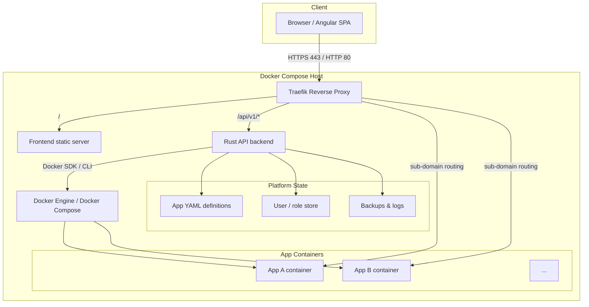
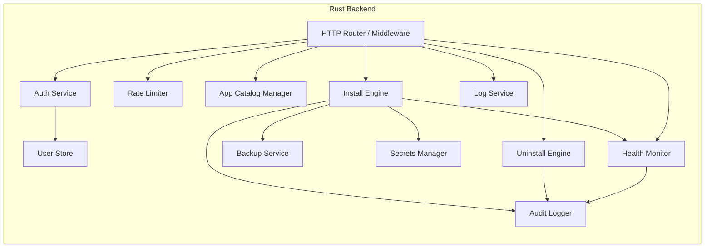
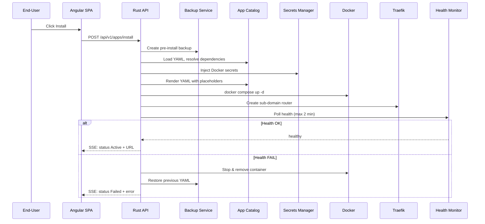
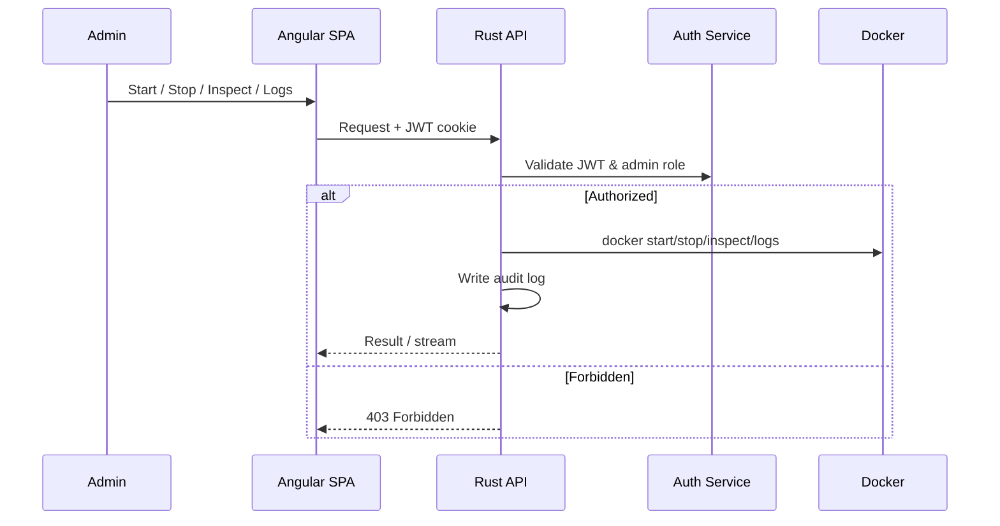
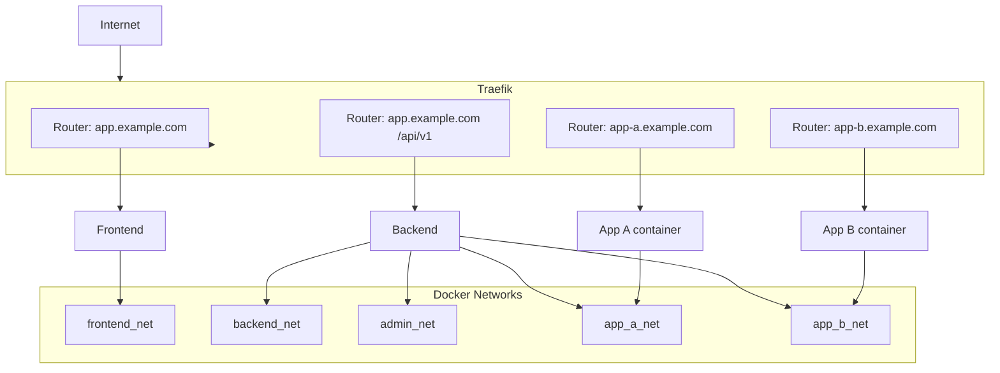

# Architecture Document – Server App Manager

## 1. Purpose & Scope

This document describes the target architecture for the **Server App Manager** platform. It is derived from the functional and non-functional requirements captured in:

- `docs/PRD.md`
- `docs/USER_STORIES.md`

The architecture is intentionally shaped for a **single-tenant, self-hosted “app store”** experience. Multi-tenancy and cross-app network policies are explicitly out of scope for the current release and are treated as future extension points.

## 2. Architectural Drivers

| Driver                   | Source                                          | Architectural Implication                                                                                                |
| ------------------------ | ----------------------------------------------- | ------------------------------------------------------------------------------------------------------------------------ |
| Reproducible deployments | PRD §3, US-1                                    | Everything runs inside a versioned Docker Compose stack; app definitions are YAML/Compose files.                         |
| Security & auditability  | PRD §3, US-5, US-11, US-16, US-20, US-26, US-32 | JWT + RBAC, Docker secrets, CORS/CSRF, hardened HTTP headers, and audit logging are first-class concerns at every layer. |
| One-click automation     | PRD §3, US-6, US-22, US-25                      | The backend orchestrates the full install/health/ingress/rollback loop with real-time status push.                       |
| Operational safety       | PRD §3, US-9, US-10, US-21, US-22               | Pre-install and nightly backups, dependency-aware uninstall, and automatic rollback on failure.                          |
| Observability            | PRD §3, US-3, US-29                             | Health dashboard, structured errors, daily logs, log streaming, and SSE/WebSocket updates.                               |
| i18n & accessibility     | PRD §8.4, US-31                                 | Frontend built with translatable strings and WCAG 2.1 AA patterns.                                                       |

## 3. High-Level Architecture

The platform follows a **three-tier, containerized pattern**:

1. **Presentation tier** – Angular SPA served by a lightweight static web server.
2. **Application tier** – Rust REST API that exposes the platform domain and orchestrates Docker.
3. **Infrastructure tier** – Docker Engine / Docker Compose, Traefik for ingress/SSL, and the filesystem for state, logs, and backups.



### Rationale

- **Traefik at the edge** handles HTTPS termination, Let’s Encrypt ACME, sub-domain routers, and security headers in one place.
- **Rust backend** is the single authority for identity, authorization, app lifecycle, secrets, and audit logging.
- **Docker/Compose** provides the reproducible runtime that all user stories assume.
- **Filesystem-based state** keeps the MVP simple while remaining version-controllable and backup-friendly.

## 4. Component Model

| Component                  | Responsibility                                                                                            | Key Requirements                      |
| -------------------------- | --------------------------------------------------------------------------------------------------------- | ------------------------------------- |
| **Angular SPA**            | End-user and admin UI: app store, dashboards, install modals, admin panels.                               | US-2, US-3, US-6, US-12, US-13, US-31 |
| **Static Web Server**      | Serves the compiled Angular bundle.                                                                       | US-1                                  |
| **Traefik**                | Reverse proxy, sub-domain routing, SSL/TLS termination, security headers.                                 | US-1, US-24, US-28, US-32             |
| **Rust REST API**          | Core domain API, orchestration, validation, audit logging.                                                | PRD §7, US-4, US-16, US-18, US-30     |
| **Auth Service**           | JWT issuance/validation, role claim enforcement, password hashing.                                        | US-5, US-11, US-16                    |
| **Role/Permission Store**  | `roles.yaml` loaded at startup; maps roles to permission names.                                           | PRD §7.5, US-11, US-16                |
| **Container Orchestrator** | Pulls images, creates/starts/stops/removes containers and networks, tracks health.                        | US-2, US-4, US-6, US-28               |
| **App Catalog Manager**    | Loads/validates YAML from `apps/store`, `apps/enabled`, `apps/disabled`; handles placeholders.            | US-7, US-14, US-18                    |
| **Install Engine**         | Pre-install backup, YAML rendering, dependency resolution, `docker compose up`, health polling, rollback. | US-6, US-8, US-22, US-25              |
| **Uninstall Engine**       | Dependency-aware stop/remove, volume/network/DNS cleanup.                                                 | US-9, US-10                           |
| **Secrets Manager**        | Creates/updates/lists/removes Docker secrets; never exposes values.                                       | US-20                                 |
| **Health Monitor**         | Polls container health, streams status via SSE/WebSocket, logs failures.                                  | US-3, US-6, US-25                     |
| **Audit Logger**           | Records user ID, endpoint, outcome, resource ID, and timestamp.                                           | US-5, US-11, US-12, US-13             |
| **Backup Service**         | Pre-install and 02:00 UTC nightly backups; retention policy enforcement.                                  | US-21                                 |
| **Log Service**            | Daily plain-text logs, rotation, and streaming API.                                                       | US-29                                 |
| **Rate Limiter**           | Per-user and per-app install throttling.                                                                  | US-25                                 |
| **OpenAPI / Docs**         | Versioned spec served at `/docs` and `/docs-json`.                                                        | US-17, US-30                          |



## 5. Runtime Views

### 5.1 One-Click App Installation



### 5.2 Admin Container Management



## 6. Data & State

### 6.1 Data Entities

| Entity              | Storage Form       | Location                                                                          | Notes                                                       |
| ------------------- | ------------------ | --------------------------------------------------------------------------------- | ----------------------------------------------------------- |
| App definitions     | YAML files         | `apps/store/<slug>.yaml`, `apps/enabled/<slug>.yaml`, `apps/disabled/<slug>.yaml` | Version-controlled templates and per-tenant runtime copies. |
| Users               | Structured records | `data/users.<ext>` or SQLite                                                      | bcrypt hashed passwords, role, status, last login.          |
| Roles & permissions | YAML               | `roles.yaml`                                                                      | Loaded at startup; permission matrix.                       |
| Secrets             | Docker secrets     | Docker Swarm secret store                                                         | Referenced by name in Compose `secrets:` blocks.            |
| App runtime data    | Docker volumes     | `tenant_<id>_data` and per-app volumes                                            | Backed up before installs and nightly.                      |
| Backups             | Archives           | `/backups/<tenant>/`                                                              | Timestamped volume + YAML snapshots.                        |
| Logs                | Plain text         | `/logs/<tenant>/`                                                                 | One file per day, retention/size policy.                    |

### 6.2 Data Flow Principles

- **File-based app catalog** keeps the install/uninstall lifecycle transparent and easy to diff/rollback.
- **Docker secrets** are the only long-term storage for sensitive values; the backend never writes them to logs or API responses.
- **Tenant namespacing** (`tenant_<id>_`) is applied to networks, volumes, and backup/log paths to preserve the future multi-tenant option.

## 7. Networking & Ingress



### Design Decisions

- **Per-app network** (`app_<slug>`) isolates application traffic and prevents unintended cross-app communication.
- **Admin network** spans app networks where the installer must reach the app for health/readiness probes.
- **Traefik routers** are generated per app with the sub-domain rule; TLS is served by the default Let’s Encrypt resolver or a custom `tls-custom` secret.
- **Port exposure** is limited to `80` and `443` on the host; platform and app services bind to internal Docker networks.

## 8. Security Architecture

### 8.1 Authentication & Authorization

- **JWT** signed with HS256/RS256 and delivered in a `Secure`, `HttpOnly`, `SameSite=Strict` cookie.
- Token claims: `user_id`, `role`, `tenant_id`.
- Angular guards and backend middleware both enforce role checks.
- All mutating endpoints require `admin` role except end-user owned install/uninstall of their own apps.

### 8.2 Secrets Management

- Sensitive data lives in **Docker secrets** only.
- The admin UI lists names and masked values.
- Backend references secrets by name and maps them to container environment variables via `docker-compose.yml` `secrets:` blocks.

### 8.3 Input & Execution Safety

- JSON-Schema validation for every mutable endpoint.
- Sanitization before Docker calls: shell-escaping, YAML quoting, JSON escaping.
- App YAML is validated against a JSON Schema before any filesystem or Docker action.

### 8.4 Transport & Headers

- **CORS** restricted to the Angular SPA origin.
- **CSRF** token verified on POST/PUT/DELETE.
- Security headers applied by both Traefik and backend middleware:
  - `Content-Security-Policy` (nonce-based)
  - `X-Content-Type-Options: nosniff`
  - `X-Frame-Options: DENY`
  - `Referrer-Policy: strict-origin-when-cross-origin`
  - `Strict-Transport-Security` (HTTPS)
  - `X-XSS-Protection: 1; mode=block`

### 8.5 Audit

Every protected action and admin operation is logged with:

- user ID
- endpoint / action
- outcome
- container / app / resource ID
- timestamp

## 9. API & Integration

- **Base path**: `/api/v1`
- **Authentication**: JWT in HttpOnly cookie
- **Spec**: OpenAPI 3.0+ in `api/swagger.yaml`, served at `/docs` and `/docs-json`
- **Versioning**: `/docs/v1`, `/docs-json/v1`; new major versions under `/api/v2`

### Endpoint Groups

| Group      | Representative Endpoints                                                                                                                           |
| ---------- | -------------------------------------------------------------------------------------------------------------------------------------------------- |
| Auth       | `POST /auth/login`, `POST /auth/forgot-password`                                                                                                   |
| Users      | `GET /users`, `POST /users`, `PUT /users/{id}/password`, `PUT /users/me`                                                                           |
| Apps       | `GET /apps`, `POST /apps/install`, `POST /apps/{slug}/uninstall`                                                                                   |
| Containers | `POST /containers/launch`, `POST /containers/start/{id}`, `POST /containers/stop/{id}`, `GET /containers/{id}/health`, `GET /containers/{id}/logs` |
| Roles      | `GET /roles`, `POST /roles`, `PUT /roles/{name}`                                                                                                   |
| Logs       | `GET /logs?appSlug=&date=`                                                                                                                         |

## 10. Observability

### 10.1 Metrics & Health

- Container Dashboard refreshes every 10 seconds and preserves sort/filter state.
- Health status is derived from Docker `health_status` or a custom `/healthz` endpoint.
- Unhealthy rows are highlighted; tooltips display failure reason.
- Updates are pushed to clients via SSE or WebSocket.

### 10.2 Logging

- Daily plain-text logs in `/logs/<tenant>/`.
- Log line: timestamp, level, component, user ID, message.
- Rotation based on retention days and max daily size.

### 10.3 Error Handling

- Structured error responses with `code`, `message`, and optional `details`.
- No stack traces or secret values in client-facing errors.
- All errors logged server-side with user ID, endpoint, and a hash of the payload.

## 11. Deployment & Operations

### 11.1 Baseline Stack

```yaml
services:
  backend:
    build: ./backend
    volumes:
      - app_data:/data
    networks:
      - backend
      - admin
  frontend:
    build: ./frontend
    networks:
      - frontend
  traefik:
    image: traefik
    ports:
      - "80:80"
      - "443:443"
    volumes:
      - /var/run/docker.sock:/var/run/docker.sock
      - ./traefik:/etc/traefik
    networks:
      - frontend
      - backend
      - admin

volumes:
  app_data:
```

### 11.2 Resource Governance

- Default `mem_limit` and `cpu_quota` for each Compose service.
- Docker resource limits per app are part of the app YAML schema.
- Install engine validates sufficient resources before launching a child container.

### 11.3 Backup & Retention

- Pre-install snapshot of volume + YAML.
- Nightly 02:00 UTC backup of all persisted volumes and `enabled/`/`disabled/` YAML.
- Retention: default 30 days, max 7 backups per day.

## 12. CI/CD Pipeline

GitHub Actions (`.github/workflows/ci.yml`):

1. **Build & test** – `cargo build --release`, `cargo test`, artifact caching.
2. **Lint YAML** – `yamllint` and schema validation for `apps/`, `roles/`, and config files.
3. **End-to-end tests** – Docker-in-Docker install/stop/rollback flow.
4. **Docker build** – image tagged with commit SHA and `latest`.
5. **Security scan** – Trivy or grype; fail on CVE severity ≥ 7.
6. **Push** – to Docker Hub using repository secrets.

## 13. Scalability & Future-Proofing

### Current Release (Single-Tenant)

- One platform stack per tenant.
- Tenant ID prefixes networks, volumes, backups, and logs.
- A single Rust backend owns all app lifecycle operations.

### Future Extension Points (P3)

- **True multi-tenancy**: separate per-tenant namespaces, isolated data planes, and a multi-tenant user store.
- **Cross-app network policies**: explicit allow-lists between app networks.
- **Object storage backups**: replace path-based backups with S3-compatible object storage.

## 14. Risks & Mitigations

| Risk                   | Mitigation                                                                                                       |
| ---------------------- | ---------------------------------------------------------------------------------------------------------------- |
| Docker socket exposure | Mount read-only with Traefik; validate all image names and arguments; never pass unsanitized input to the shell. |
| Secret leakage         | Keep values in Docker secrets only; never log or serialize them.                                                 |
| Install spam / abuse   | Rate limiting per user and per app.                                                                              |
| Rollback failure       | Pre-install snapshot before every install; restore previous YAML and container state.                            |
| Certificate failures   | Fallback to custom cert upload; clear error messages and logs.                                                   |

## 15. Technical Constraints & Edge-Case Handling

The constraints and edge cases captured in `docs/USER_STORIES.md` drive component boundaries, validation order, and failure-mode handling. They are organized by functional area below.

### 15.1 Baseline Platform Stack

| Constraint / Assumption                                                                      | Edge Case                                        | Architectural Response                                                                  |
| -------------------------------------------------------------------------------------------- | ------------------------------------------------ | --------------------------------------------------------------------------------------- |
| `docker-compose.yml` defines `backend`, `frontend`, `traefik` with ports `80`/`443` exposed. | Docker / Docker Compose missing on a clean host. | Pre-start health script and CI smoke test fail fast with a clear message.               |
| `mem_limit` and `cpu_quota` declared for every service.                                      | Host lacks resources for declared limits.        | Pre-validate the Compose file; install engine rejects requests the host cannot satisfy. |
| Named volume `app_data` mounted at `/data` in the backend.                                   | Host mount is read-only or permission denied.    | Set `read_only: false`; check path writability at startup.                              |
| All Docker resources prefixed with the tenant ID.                                            | Two tenants use the same ID.                     | Enforce uniqueness at provisioning and runtime; tenant ID is the namespace key.         |
| `docker compose up --build` must pass on a clean machine.                                    | Rust compilation or dependency failure.          | CI runs uncached builds and surfaces full build logs.                                   |

### 15.2 Container Launch & Child Containers

| Constraint / Assumption                                                                           | Edge Case                                                                | Architectural Response                                                                            |
| ------------------------------------------------------------------------------------------------- | ------------------------------------------------------------------------ | ------------------------------------------------------------------------------------------------- |
| `POST /containers/launch` requires a valid JWT and role check.                                    | Token expires during a long request.                                     | 401 → Angular redirects to login.                                                                 |
| Validate image existence, host resources, port format (`^[0-9]+(:[0-9]+)?$`), and command syntax. | Image not found, invalid command, port conflict, or insufficient memory. | Validation layer returns `400` / `403` with specific `code` and `message` before any Docker call. |
| Use `--network tenant_<id>_net` and a tenant data mount only when the image expects data.         | A network name already exists for a different tenant.                    | Network creation is idempotent or returns a clear conflict; tenant prefix prevents collisions.    |
| Inject `--secret` for referenced secrets and `--env` for user variables.                          | Referenced secret does not exist.                                        | `400` `Secret <name> not defined`; UI blocks submission when possible.                            |

### 15.3 Container Dashboard & Health Monitoring

| Constraint / Assumption                                      | Edge Case                                   | Architectural Response                                                        |
| ------------------------------------------------------------ | ------------------------------------------- | ----------------------------------------------------------------------------- |
| Table refreshes every 10 s without losing sort/filter state. | Network drop or SSE stall.                  | Client preserves state in memory; UI shows a reconnect indicator and retries. |
| Health from Docker `health_status` or fallback `/healthz`.   | No health-check and `/healthz` unreachable. | Status remains “Starting” until timeout; each probe failure is logged.        |
| Unhealthy rows are highlighted with tooltips.                | Rapid successive failures.                  | Debounce tooltips; log every occurrence server-side.                          |

### 15.4 Admin Container API

| Constraint / Assumption                                                                                                                           | Edge Case                            | Architectural Response                                     |
| ------------------------------------------------------------------------------------------------------------------------------------------------- | ------------------------------------ | ---------------------------------------------------------- |
| `POST /containers/start/{id}` returns `200` with `containerId`; `stop` returns `200`; `GET /{id}` returns metadata; `GET /{id}/logs` streams SSE. | Container does not exist.            | `404` with a clear code.                                   |
| All endpoints require the `admin` role and tenant ownership.                                                                                      | Container belongs to another tenant. | `403` (or `404` to avoid information leakage).             |
| OpenAPI spec at `api/swagger.yaml` served at `/docs` and `/docs-json`.                                                                            | Spec is missing or malformed.        | `500`; CI runs `swagger-cli validate` and fails the build. |

### 15.5 Authentication, Authorization & CORS

| Constraint / Assumption                                                                         | Edge Case                             | Architectural Response                                      |
| ----------------------------------------------------------------------------------------------- | ------------------------------------- | ----------------------------------------------------------- |
| JWT in a `Secure`, `HttpOnly`, `SameSite=Strict` cookie; claims `user_id`, `role`, `tenant_id`. | Token missing, malformed, or expired. | `401`; Angular redirects to login.                          |
| Endpoints that mutate apps/users/roles/settings require `admin`.                                | `role` claim is missing.              | `401`; token issuance must always include the role.         |
| CORS allows only the Angular SPA origin.                                                        | Sub-resource call lacks CORS header.  | Middleware applies CORS uniformly to API and static routes. |
| CSRF token on state-changing `POST`/`PUT`/`DELETE`.                                             | Missing or outdated token.            | `403`; UI refreshes the token before submitting.            |

### 15.6 App Install & Rollback

| Constraint / Assumption                                                                       | Edge Case                    | Architectural Response                                                 |
| --------------------------------------------------------------------------------------------- | ---------------------------- | ---------------------------------------------------------------------- |
| Modal lists required/optional parameters from the YAML; UI validates type, regex, and length. | Missing or invalid field.    | UI blocks; otherwise backend returns `400` with field-specific errors. |
| Placeholders `{{PLACEHOLDER}}` are substituted before rendering.                              | Undefined placeholder.       | `400` `Placeholder {{X}} not defined in app YAML`.                     |
| `docker compose up -d` followed by a 2-minute health poll.                                    | App never becomes healthy.   | Rollback: `docker rm -f`, restore previous YAML, return `409`.         |
| Sub-domain created via Traefik API or DNS.                                                    | Let’s Encrypt / DNS failure. | UI shows “Domain provisioning failed”; log and allow retry.            |
| Pre-install backup before container creation.                                                 | Snapshot fails.              | Log failure; still attempt rollback and warn the admin.                |
| Rate limits: 1 install per user per 30 s; 1 per app per 5 s.                                  | Repeated clicks.             | `429` with a friendly wait message.                                    |

### 15.7 YAML & App Catalog

| Constraint / Assumption                                             | Edge Case                                        | Architectural Response                                  |
| ------------------------------------------------------------------- | ------------------------------------------------ | ------------------------------------------------------- |
| YAML follows a JSON Schema; invalid files return `400`.             | YAML syntax error or missing `image`.            | Schema validator returns structured errors.             |
| Only `apps/store`, `apps/enabled`, `apps/disabled` are valid paths. | File outside these folders or symlink traversal. | Path sanitization; `404` for disallowed paths.          |
| `depends_on` resolved before dependent app.                         | Circular dependency.                             | Detected during install; return `409`.                  |
| Enable / Disable / Delete move YAML atomically.                     | Concurrent enable/disable/delete.                | File locking or atomic move; serialize or return `409`. |

### 15.8 Uninstall & Dependency Cleanup

| Constraint / Assumption                                          | Edge Case                                   | Architectural Response                                  |
| ---------------------------------------------------------------- | ------------------------------------------- | ------------------------------------------------------- |
| Dependency guard: running dependents block non-admin uninstall.  | Admin confirms but a dependent cannot stop. | `403` `Cannot stop container <id>`; no partial cleanup. |
| Stop/remove containers, optionally volumes/networks, remove DNS. | Volume still in use by another container.   | `500`; do not delete shared volumes.                    |
| Concurrent uninstall on the same app.                            | Race condition.                             | Serialize or return `409`.                              |

### 15.9 Admin App & User Management

| Constraint / Assumption                                                         | Edge Case                         | Architectural Response                                                       |
| ------------------------------------------------------------------------------- | --------------------------------- | ---------------------------------------------------------------------------- |
| App management actions require the `admin` role.                                | User crafts a direct API request. | Backend role check returns `403`; UI buttons are hidden as defence in depth. |
| User creation enforces unique username/email, bcrypt hash, default `user` role. | Duplicate or weak password.       | `400` with details.                                                          |
| Passwords are never returned; only hashes stored.                               | Privilege-escalation attempt.     | Verify the caller is `admin` before any role promotion.                      |

### 15.10 Docker Secrets

| Constraint / Assumption                               | Edge Case                                               | Architectural Response                                                           |
| ----------------------------------------------------- | ------------------------------------------------------- | -------------------------------------------------------------------------------- |
| `secrets:` block maps `source` to a `target` env var. | Secret name collision or value with special characters. | Validate and sanitize before `docker secret create`; Docker enforces uniqueness. |
| Admin list shows names only (values masked).          | Deletion while a container is running.                  | Stop the container or return `409`; clear YAML reference.                        |
| Never log secret values.                              | Logging misconfiguration.                               | Code review and CI lint for accidental secret logging.                           |

### 15.11 Backups & Retention

| Constraint / Assumption                               | Edge Case                      | Architectural Response                    |
| ----------------------------------------------------- | ------------------------------ | ----------------------------------------- |
| Retention days (default 30), max per day (default 7). | Insufficient disk space.       | Backup aborts; UI alerts; log warning.    |
| Pre-install + nightly 02:00 UTC snapshots.            | Concurrent install and backup. | Lock the app data directory or serialize. |
| Backups on mounted volume or object storage.          | Permission errors.             | Startup check of backup path writability. |

### 15.12 SSL Certificates

| Constraint / Assumption                                    | Edge Case                                    | Architectural Response                                                 |
| ---------------------------------------------------------- | -------------------------------------------- | ---------------------------------------------------------------------- |
| Auto-SSL ON by default; custom cert upload.                | Let’s Encrypt rate limit or DNS propagation. | Exponential backoff; manual retry after 24 h.                          |
| Certs stored as Docker secrets (`tls-cert`, `tls-custom`). | Invalid PEM or key mismatch.                 | Validate PEM before creating secret; surface Traefik TLS errors in UI. |
| Secrets mounted read-only into Traefik.                    | Renewal or upload without restart.           | Hot-reload Traefik dynamic config.                                     |

### 15.13 Networking & Ingress

| Constraint / Assumption                                         | Edge Case                    | Architectural Response                                       |
| --------------------------------------------------------------- | ---------------------------- | ------------------------------------------------------------ |
| Per-app network `app_<slug>`; admin network spans app networks. | Two apps with the same slug. | Append tenant ID to network name.                            |
| Traefik router per sub-domain.                                  | Router misconfiguration.     | Install health check fails; report DNS / reachability error. |
| Cross-app communication denied by default.                      | Network driver unavailable.  | `500` “Network creation failed”.                             |

### 15.14 Schema Validation & Sanitization

| Constraint / Assumption                                                   | Edge Case                         | Architectural Response                                                 |
| ------------------------------------------------------------------------- | --------------------------------- | ---------------------------------------------------------------------- |
| JSON Schema for every mutable endpoint; validate before Docker / FS / DB. | Oversized payload.                | Limit body size to ~1 MB; `413` on overflow.                           |
| Sanitize shell, YAML, and JSON inputs.                                    | Command injection (`; rm -rf /`). | Shell-escape or reject; validation layer runs before the orchestrator. |

### 15.15 Logging

| Constraint / Assumption                                 | Edge Case                                  | Architectural Response                              |
| ------------------------------------------------------- | ------------------------------------------ | --------------------------------------------------- |
| One plain-text file per day; retention and size limits. | Disk full.                                 | Alert admin; enforce max size or rotation.          |
| `GET /logs?appSlug=&date=` streams the file.            | Concurrent writes from multiple processes. | Append with atomic rename or per-process buffering. |

### 15.16 API Versioning & OpenAPI

| Constraint / Assumption                                                  | Edge Case                    | Architectural Response                                           |
| ------------------------------------------------------------------------ | ---------------------------- | ---------------------------------------------------------------- |
| All public APIs under `/api/v1`; spec at `/docs/v1` and `/docs-json/v1`. | Spec drift.                  | CI validates `api/swagger.yaml` on every PR.                     |
| 12-month backward compatibility.                                         | Old client after major bump. | Non-breaking changes in minor versions; deprecation annotations. |

### 15.17 Error Handling

| Constraint / Assumption                                        | Edge Case                  | Architectural Response                              |
| -------------------------------------------------------------- | -------------------------- | --------------------------------------------------- |
| Error shape `{code, message, details?}`.                       | Unexpected `500`.          | Default generic message; never expose stack traces. |
| Log user ID, endpoint, and a hash of the payload (no secrets). | Payload contains a secret. | Redact secrets before hashing.                      |

### 15.18 CI/CD

| Constraint / Assumption                                            | Edge Case                      | Architectural Response                               |
| ------------------------------------------------------------------ | ------------------------------ | ---------------------------------------------------- |
| Jobs: build/test, lint-yaml, e2e, docker-build, Trivy/grype, push. | Docker-in-Docker unavailable.  | Use self-hosted runners or a DinD service container. |
| Fail on CVE severity ≥ 7.                                          | False positive.                | Allow threshold tuning in CI config.                 |
| Push to Docker Hub.                                                | Missing `DOCKERHUB_*` secrets. | Fail fast with a clear message.                      |

## 16. References

- `docs/PRD.md` – Product Requirements Document
- `docs/USER_STORIES.md` – Detailed user stories and acceptance criteria
